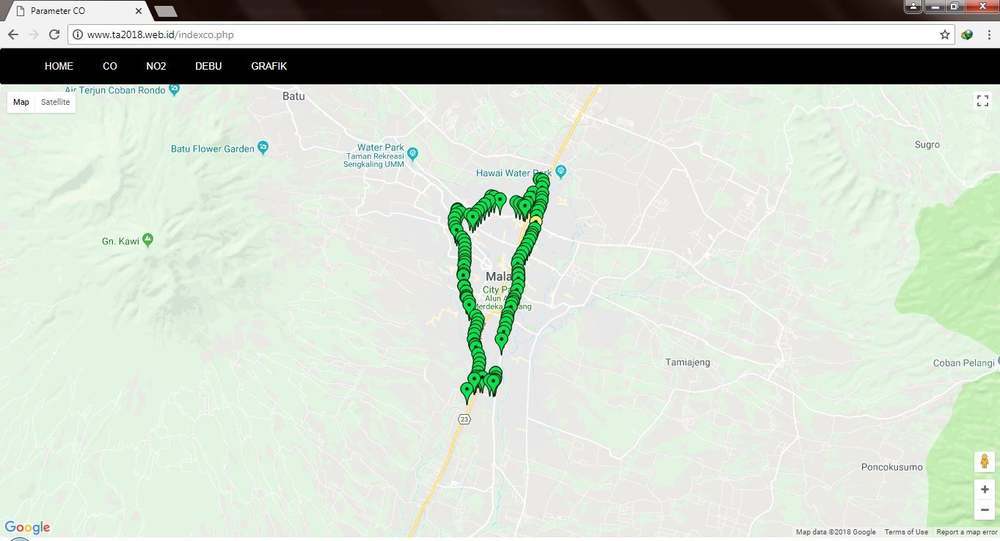
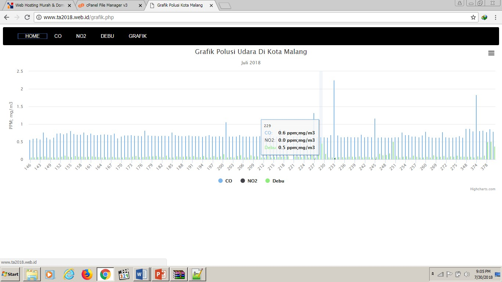

<h1 align="center">Website Polusi Udara di Kota Malang</h1>

  

 

  Built with PHP & MySQL

## Table of Contents

- [Introduction](#introduction)
- [Features](#features)
- [Screenshots](#screenshots)

## Introduction
Website Polusi Udara di Kota Malang adalah website untuk melihat daerah mana saja yang terkena pencemaran udara, kami membuat sebuah alat untuk mendeteksinya dengan menggunakan sensor analog dan diolah oleh arduino untuk dikirimkan ke database mysql dan ditampilkan ke website dengan marker, apabila marker hijau maka aman, apabila sedang marker akan bewarna kuning, dan untuk bahaya marker akan bewarna merah.
Untuk pengaturan Arduino bisa baca [disini](https://github.com/abdillahtop/Arduino-Polution)

## Features
* Kadar CO di suatu daerah
* Kadar NO2 di suatu daerah
* Kadar debu di suatu daerah
* Grafik masing" kadar

## Screenshots

    
     
     

### License
----

© [Abdillah Dzulfikar Mustanir](https://github.com/abdillahtop/)

