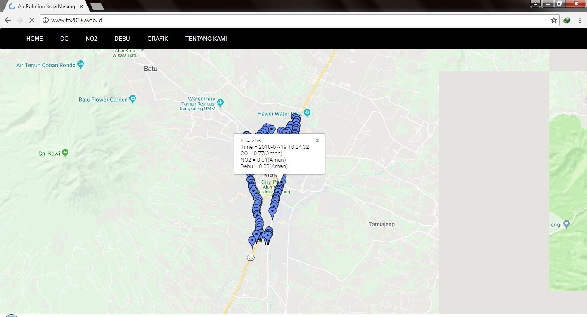

<h1 align="center">Website Polusi Udara di Kota Malang</h1>

  

 

  Built with PHP & MySQL

## Table of Contents

- [Introduction](#introduction)
- [Features](#features)
- [Screenshots](#screenshots)
- [Deploy Website](#deploy-website)
- [Contributors](#contributors)

## Introduction
Website Polusi Udara di Kota Malang adalah website untuk melihat daerah mana saja yang terkena pencemaran udara, kami membuat sebuah alat untuk mendeteksinya dengan menggunakan sensor analog dan diolah oleh arduino untuk dikirimkan ke database mysql dan ditampilkan ke website dengan mengintegrasikan API

## Features
* Kadar CO di suatu daerah
* Kadar NO2 di suatu daerah
* Kadar debu di suatu daerah
* Grafik masing" kadar

## Screenshots

     

## Contributors

  <table>
    <tr>
      <td align="center">
        <a href="https://github.com/abdillahtop">
           
          <b>Abdillah Dzulfikar Mustanir</b>
        </a>
      </td>
    </tr>
  </table>

### License
----

© [Abdillah Dzulfikar Mustanir](https://github.com/abdillahtop/)

